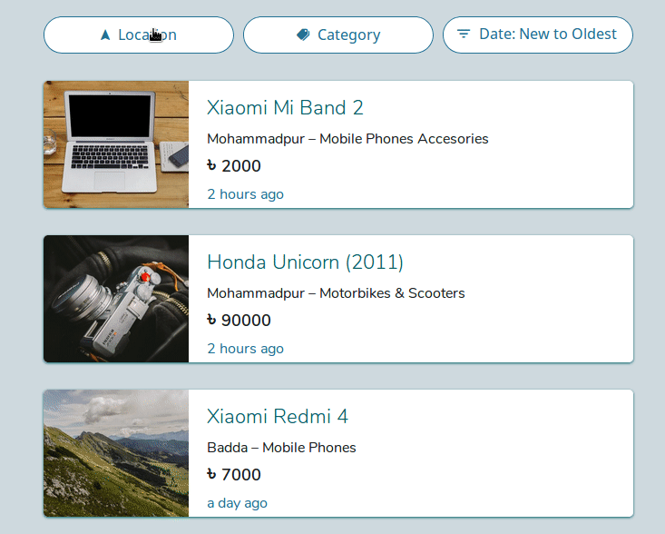
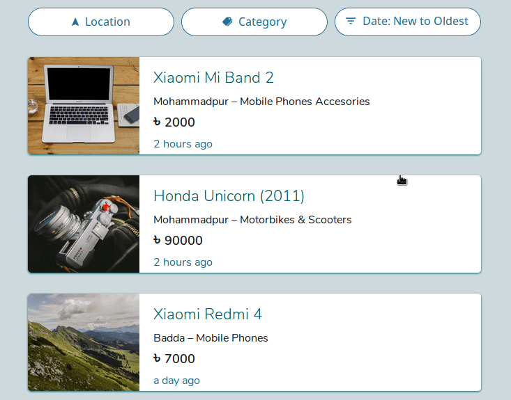
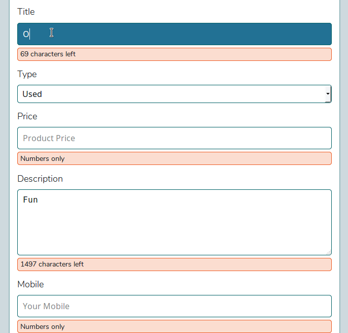

# Buy & Sell

A web application for Dhaka city people to buy and sell their products. Partially clone from Bikroy.com

## Live

Anyone can browse full application but can submit any data. To prevent spam data entry i disable write permission. For deploy as your own [visit](https://github.com/momitrahman/buy-and-sell#-deploy-own-your-environment)

Demo: https://buy-sell-d51cc.firebaseapp.com

## Built With

- [React](https://reactjs.org),
- [React Router](https://reacttraining.com/react-router/web/guides/philosophy),
- [Firebase](https://firebase.google.com/) (Realtime Database, Authentication)
- [Styled Components](https://github.com/styled-components/styled-components)
- and other helper package [Ionicons](https://ionicons.com), [Moment.js](https://momentjs.com/), [re-base](https://github.com/tylermcginnis/re-base)
- For dummy image [picsum.photos](https://picsum.photos/)

## Features

- On type search by item name.

- Filter item by location, category.

- Sort by date or prize.

- On type validation.

- Authentication only for Google account.
- Any authentic user can post advertise also can edit, delete.

## What i have done?

**NO UI LIBRARY/ PACKAGE USED**

- Followed React file structure pattern.
- For styling used CSS with helper of styled-components.
- Made my own
  - Modal
  - Cascader
  - Confirm Box
  - Dropdown Menu
- All filter, sort are done in client side.
- Location, category, item list are load from firebase.

## Deploy own your environment

Make sure you have installed

- Node > 8.0
- NPM

Now follow these steps

- git clone https://github.com/momitrahman/buy-and-sell
- npm i
- Create a new project in firebase and copy your web. app config then paste into `/src/firebase.js` file in **key** variable.
- To understand database structure check `/sample_data.json`
- In firebase enable - `Authentication > Sign-in Method > Google`
- npm start

## My Todo

- [ ] Image upload option using cloudinary.com
- [ ] Image slider
